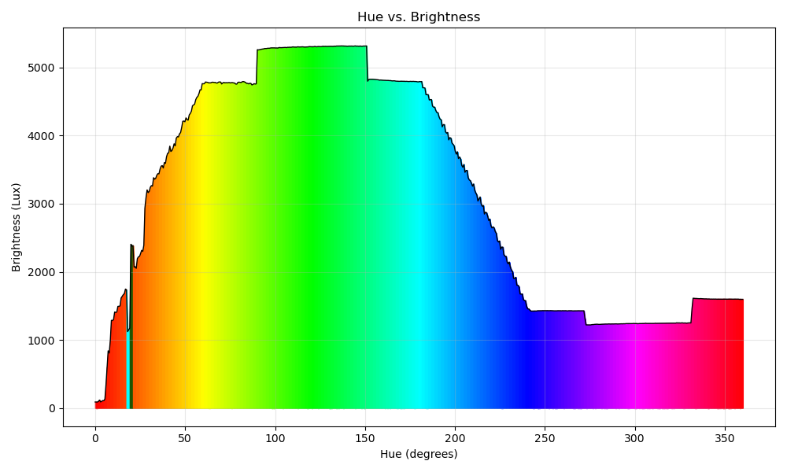

# Wavelength and Brightness ISI Experiment

## Installation

1. Install the official CLI: https://arduino.github.io/arduino-cli/0.32/installation/
2. Install the required libraries: `arduino-cli lib install "Adafruit TCS34725"`
3. Generate default config file: `arduino-cli config init`
4. Update local cache of libraries: `arduino-cli core update-index`
5. Connect your board and verify that its connected properly: `ardunio-cli board list`
```
Port         Protocol Type              Board Name  FQBN            Core
/dev/ttyACM0 serial   Serial Port (USB) Arduino Uno arduino:avr:uno arduino:avr
```

6. *Note:* The core platform should already be installed, but if it's not, install it via `arduino-cli core install arduino:aavr`
7. Clone this repo: `git clone https://github.com/big-spieg/light-brightness-experiment`
8. Compile and automatically upload the sketch with `make`
9. This will also open up a serial monitor where you can view and copy the data from the experiment.
10. Copy the data from the experiment into input.txt
11. Run the postprocessing analysis: `python3 analysis.py`

## Results


